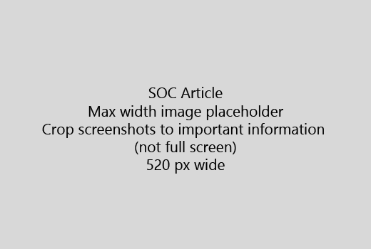

Démarrez votre article avec une très brève introduction (1 phrase). Vous-même mis en place le lecteur - pourquoi sont-elles ici ? Que doit faire ?Start your article with a very short introduction (1 sentence). Put yourself in the reader's place - why are they here? What should they do? 
  
1. Obtenir le droit à une liste rapide des étapes à effectuer la tâche.Get straight to a quick list of steps to accomplish the task.
    
    Si vous avez besoin afin d’expliquer un concept, ou ils doivent effectuer les étapes préalables, ajoutez un résumé rapide sous l’étape où dont ils ont besoin et le [lien](https://support.office.com/article/f37e7984-cf03-4fde-92d3-82970d7e241b.aspx) vers le concept ou les étapes.If you need to explain a concept, or they have to do pre-requisite steps, add a quick summary below the step where they need it, and [link](https://support.office.com/article/f37e7984-cf03-4fde-92d3-82970d7e241b.aspx) to the concept or steps. 
    
2. Conservez les procédures courts - étapes de préférence 5 ou moins, pas plus de 8.Keep procedures short - preferably 5 or fewer steps, no more than 8.
    
3. Utiliser le **style d’interface utilisateur** pour les éléments d’interface utilisateur ou de texte pour les utilisateurs doivent saisir.Use **Ui style** for user interface elements or for text people need to enter. 
    
4. Utiliser les verbes choisissent, ou entrer en tant que des actions et sélectionnez le format menus **Menu** \> **commande**.Use the verbs choose, select, or enter as actions, and format menus as **Menu** \> **Command**.
    
5. Si vous le souhaitez, ajoutez une capture d’écran de contexte (si l’interface utilisateur est difficile de localiser, ou il a besoin effectuer la tâche).Optionally, add a screenshot for context (if UI is hard to locate, or it's needed to complete the task).
    
    Largeur maximale : 520 pixels. Utiliser un thème standard, ne pas afficher les informations personnelles et rogner pour afficher uniquement ce qui est pertinent.Maximum width: 520 pixels. Use a standard theme, do not show any personal information, and crop to show only what's relevant. 
    
    
  
Si vous souhaitez ajouter une vidéo ou une capture d’écran, utilisez une grille de deux colonnes et les étapes de la gauche et la vidéo ou la capture d’écran de la droite : voir [étapes et exemple de grille vidéo](https://support.office.com/article/14ce8e82-efa0-47f5-bb84-94f078db3dae.aspx).If you want to add a video or screenshot, use a two-column grid and have the steps in the left and the video or screenshot in the right - see [Steps and video grid example](https://support.office.com/article/14ce8e82-efa0-47f5-bb84-94f078db3dae.aspx). 
  
Cible : pas plus de 500 mots pour un article.Target no more than 500 words for an article.
  
# Article exempleExample article

[Modifier ma photoChange my photo](https://support.office.com/article/555376e0-1fca-49ba-8434-307a0525c767.aspx)
  

