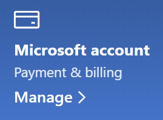

# Modifier les informations de mon compte Microsoft

Accédez à [https://account.microsoft.com](https://account.microsoft.com/) et connectez-vous, si nécessaire. Vous accédez au tableau de bord de votre compte.  

**Modifier mon nom et mes informations personnelles**

1. Dans le tableau de bord de votre compte, près de la photo et du nom de votre compte, cliquez sur **Autres actions > Modifier le profil**.
2. Sur la page **Modifier le profil**, utilisez les liens fournis pour changer votre image de profil, votre nom, la date de naissance, le lieu et la langue d’affichage. Notez les liens vers vos profils de compte Xbox ou Skype, dans lesquels vous pouvez modifier les détails spécifiques à ces comptes.

**Gérer les adresses de messagerie et les numéros de téléphone**

Un compte Microsoft dispose d’une ou plusieurs adresses de courrier ou de numéros de téléphone associés en tant qu’« alias ». Pour gérer ces éléments :

1. Dans le tableau de bord de votre compte, près de la photo et du nom de votre compte, cliquez sur **Autres actions > Modifier le profil**.
2. Dans la page **Modifier le profil**, cliquez sur **Gérer la connexion à Microsoft**. 
3. Une liste d’alias de compte s’affiche et vous pouvez gérer la liste, y compris l’ajout et la suppression d’adresses e-mail et de numéros de téléphone. Vous pouvez également sélectionner les alias pouvant être utilisés pour vous connecter au compte, et l’alias considéré comme « principal », qui s’affichera sur vos appareils Windows 10.

**Gérer les modes de paiement, ainsi que le nom et l’adresse de facturation** 

1. Dans le tableau de bord de votre compte, près de la photo et du nom de votre compte, cliquez sur **Autres actions > Modifier le profil**.
2. Sous **Paiement et facturation** cliquez sur **Gérer**.

    

3. Vous pouvez ajouter, modifier et supprimer ici les modes de paiement et leurs adresses de facturation associées. 
