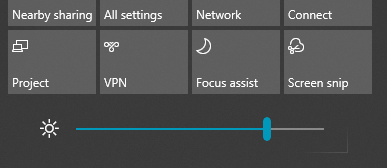

# Modification de la luminosité de l’écran dans Windows 10Change screen brightness in Windows 10

Si votre version Windows 10 est postérieur à 1903, il dispose d’un **Contrôle de la luminosité** dans le Centre de notifications.If your Windows 10 is newer than version 1903, it has a **Brightness slider** in the action center. Pour ouvrir le Centre de notifications, cliquez sur le bouton **Notifications** dans la partie la plus à droite de la barre des tâches, ou appuyez sur l’**accueil Windows + A** sur votre clavier.To open the action center, click the **Notification** button at the rightmost side of your taskbar, or press **Windows home + A** on your keyboard.

Si vous disposez d’une version antérieure de Windows 10, vous pouvez accéder au contrôle de la luminosité en accédant à **[Paramètres > Système > Affichage](ms-settings:display?activationSource=GetHelp)**.If your Windows 10 is an earlier version, you can find the brightness slider by going to **[Settings > System > Display](ms-settings:display?activationSource=GetHelp)**.

**Remarques** :**Notes**:

- Le curseur d’affichage intégré Modifier la luminosité n’existe peut-être pas sur les ordinateurs de bureau disposant d’un moniteur externe.You might not see the Change brightness for the built-in display slider on desktop PCs that have an external monitor. Pour modifier la luminosité d’un moniteur externe, utilisez les contrôles de l’écran.To change the brightness of an external monitor, use the controls on the monitor.
- Si vous ne disposez pas d’un ordinateur de bureau et que le curseur ne s’affiche pas ou ne fonctionne pas, essayez de mettre à jour le pilote d’affichage.If you don't have a desktop PC and the slider doesn't appear or work, try updating the display driver. Dans la zone de recherche dans la barre des tâches, tapez **Gestionnaire de périphériques**, puis sélectionnez **Gestionnaire de périphériques** dans la liste des résultats.In the search box on the taskbar, type **Device Manager**, and then select **Device Manager** from the list of results. Dans le **Gestionnaire de périphériques**, sélectionnez **Cartes graphiques**, puis sélectionnez la carte graphique.In **Device Manager**, select **Display adapters**, then select the display adapter. Appuyez longuement (ou cliquez avec le bouton droit) sur le nom de la carte graphique, puis cliquez sur **Mettre à jour le pilote**. Suivez ensuite les instructions.Press and hold (or right-click) the display adapter name and click **Update driver**; then follow the instructions.
