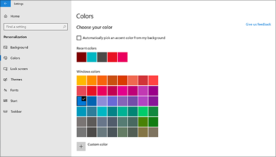
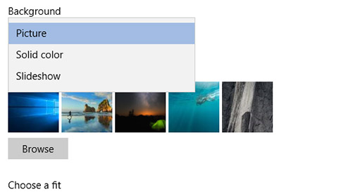

# Modifier l’arrière-plan et les couleurs de votre bureauChange your desktop background and colors

Pour modifier le paramètre couleurs, **accédez à**  >  **paramètres**de  >  **personnalisation**  >  **couleurs**, puis choisissez votre propre couleur ou laissez Windows extraire une couleur d’accentuation de votre arrière-plan.To change your colors setting, go to **Start** > **Settings** > **Personalization** > **Colors**, and then choose your own color or let Windows pull an accent color from your background.

Pour modifier l’arrière-plan du Bureau **Start**, accédez à l'  >  **Settings**  >  **Personalization**  >  **arrière-plan**de personnalisation des paramètres de démarrage, puis choisissez une image, une couleur unie, ou créez un diaporama d’images.To change your desktop background, go to **Start** > **Settings** > **Personalization** > **Background**, and then choose a picture, solid color, or create a slideshow of pictures. 

Vous souhaitez obtenir davantage d’arrière-plans et de couleurs de bureau ?Want more desktop backgrounds and colors? Visitez le site [Microsoft Store](https://www.microsoft.com/store/collections/windowsthemes) pour choisir parmi des dizaines de thèmes gratuits.Visit [Microsoft Store](https://www.microsoft.com/store/collections/windowsthemes) to choose from dozens of free themes.
