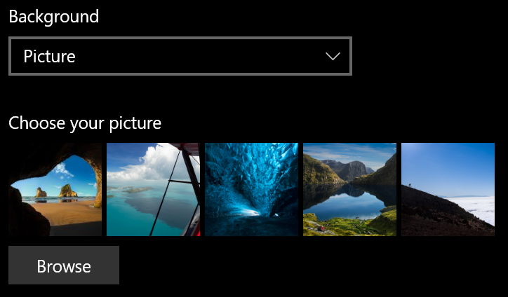
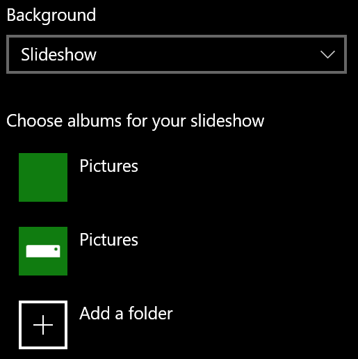

# Modifier l’arrière-plan de l’écran de verrouillageChange your lock screen background

- Accédez à **paramètres** > **personnalisation** >de l' **écran de verrouillage**.Go to **Settings** > **Personalization** > **Lock screen**. Ou cliquez ou appuyez [ici](ms-settings:lockscreen?activationSource=GetHelp).Or click or tap [here](ms-settings:lockscreen?activationSource=GetHelp).

- Pour définir une image d’arrière-plan personnalisée, sélectionnez **image** dans la liste déroulante **arrière-plan** , puis choisissez ou **accédez** à l’image.To set a custom background picture, select **Picture** from the **Background** drop-down list, and choose or **Browse** to the picture.

  

- Pour configurer un diaporama d’images personnalisées, sélectionnez **diaporama** dans la liste déroulante **arrière-plan** , puis choisissez un album ou ajoutez un dossier contenant les images du diaporama.To set up a slideshow of custom pictures, select **Slideshow** from the **Background** drop-down list, and choose an album or add a folder that contains the pictures for the slideshow.

  
