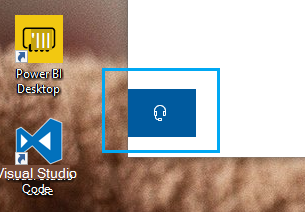

# Contactez-nous en cliquant sur le bouton casque

Si vous souhaitez contacter le Support Microsoft, cliquez sur **Contactez-nous** dans le coin inférieur gauche de cette application. À l’intérieur de la fenêtre volante, vous serez guidé vers le canal de support qui vous permettra de choisir votre produit et votre catégorie d’émission.

Vous pouvez continuer à interagir avec le reste de l’application même après avoir initié une session Contactez-nous. Le panneau Contactez-nous peut être temporairement réduit en cliquant n’importe où dans l’application. Pour revenir à la même session, il vous suffit de cliquer **à nouveau sur Contactez-nous.**
