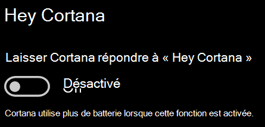

# Cortana ne me parle pas ou ne m’entend pasCortana doesn’t talk to me or can’t hear me

Si vous essayez d’utiliser la fonctionnalité « Hé Cortana », vous permettant de parler à Cortana sans sélectionner le bouton Cortana dans la barre des tâches ou le bouton du microphone dans le volet Cortana, vérifiez que la fonctionnalité est activée :If you are trying to use the "Hey Cortana" feature, which allows you to talk to Cortana without selecting the Cortana button on the taskbar or the microphone button in the Cortana panel, confirm that the feature is enabled:

1. Accédez à **Démarrer**, puis sélectionnez **[Paramètres > Cortana](ms-settings:cortana?activationSource=GetHelp)**.Go to **Start**, then select **[Settings > Cortana](ms-settings:cortana?activationSource=GetHelp)**.
2. Sous **Hey Cortana**, placez le bouton bascule de **Permettre à Cortana de répondre à « Hé Cortana »** sur **Activé**.Under **Hey Cortana**, switch the **Let Cortana respond to "Hey Cortana"** toggle to **On**.

**Vos paramètres de confidentialité empêchent-ils Cortana de vous entendre ?****Are your privacy settings preventing Cortana from hearing you?**

Vos paramètres de confidentialité peuvent empêcher Cortana de répondre à vos paroles.Your privacy settings can prevent Cortana from responding to your voice.
- Vérifiez que la reconnaissance vocale en ligne est activée :Check to make sure Online Speech recognition is turned on:
    - Accédez à **Démarrer**, puis cliquez sur **[Paramètres > Confidentialité > Voix](ms-settings:privacy-speech?activationSource=GetHelp)**.Go to **Start**, then click **[Settings > Privacy > Speech](ms-settings:privacy-speech?activationSource=GetHelp)**.
    - Sous **Reconnaissance vocale en ligne**, définissez le paramètre sur **Activé**.Under **Online speech recognition**, switch the setting to **On**.
- Vérifiez que Cortana a l’autorisation d’accès à votre micro.Check to make sure Cortana has permission to access your microphone. 
    - Accédez à Démarrer, puis cliquez sur **[Paramètres > Confidentialité > Microphone](ms-settings:privacy-microphone?activationSource=GetHelp)**.Go to Start, then click **[Settings > Privacy > Microphone](ms-settings:privacy-microphone?activationSource=GetHelp)**.
    - Sous **Choisir les applications pouvant accéder à votre microphone**, recherchez **Cortana** dans la liste des applications et services et vérifiez que le commutateur est placé sur **Activé**.Under **Choose which apps can access your microphone**, look for **Cortana** within the list of apps and services and make sure the switch is toggled to **On**.

Par ailleurs, assurez-vous que vos haut-parleurs ou microphone sont opérationnels et fonctionnent pour communiquer avec Cortana.Moreover, please also make sure that your speakers or microphones are up and working in order to talk to Cortana.
