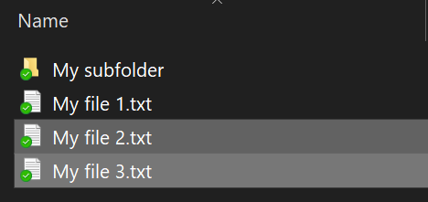
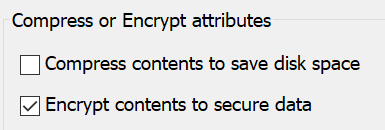

# Chiffrer des fichiers ou des dossiers dans Windows 10

BitLocker vous permet de chiffrer un disque entier. Cependant, il existe une procédure pour chiffrer uniquement certains fichiers ou dossiers (et leurs contenus) :

1. Dans l’**Explorateur de fichiers**, sélectionnez le(s) fichier(s) ou dossier(s) que vous souhaitez chiffrer. Dans cet exemple, deux fichiers ont été sélectionnés :

    

2. Cliquez avec le bouton droit sur les fichiers sélectionnés, puis cliquez sur **Propriétés**.

3. Dans la fenêtre **Propriétés de :**, cliquez sur **Avancé...**.

4. Dans la fenêtre **Propriétés avancées**, activez la case à cocher **Chiffrer le contenu pour sécuriser les données** :

    

5. Cliquez sur **OK**.
