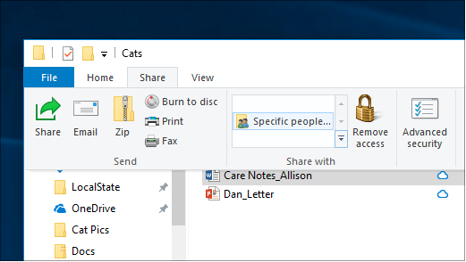
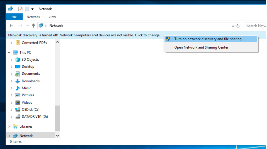

# Partage de fichiers sur un réseau dans Windows 10

**Remarque**: si vous avez déjà utilisé Le Groupement résidentiel pour le partage de fichiers, veuillez noter que le Groupement résidentiel a été supprimé de Windows 10 (version 1803). Vous pouvez désormais partager des imprimantes et des fichiers à l’aide des fonctionnalités intégrées dans Windows 10.

**Pour partager des fichiers ou des dossiers sur un réseau**

- Dans **l’Explorateur** de fichiers, sélectionnez  un fichier > cliquez sur l’onglet Partager en > dans la **section** Partager avec, cliquez sur Personnes **spécifiques.**

    
          
- Si vous sélectionnez plusieurs fichiers à la fois, vous pouvez les partager tous de la même manière. Il fonctionne également pour les dossiers.

**Pour voir les appareils sur le réseau qui partagent des fichiers**

- Dans **l’Explorateur de** fichiers, allez sur **Réseau.** Si la découverte réseau n’est pas activée, vous verrez un message d’erreur « La découverte réseau est désactivée... »

- Cliquez sur **la bannière De découverte réseau** désactivée, puis cliquez sur Activer la découverte réseau et le partage de **fichiers.**

    

[En savoir plus sur le partage de fichiers sur un réseau](https://support.microsoft.com/help/4092694/windows-10-file-sharing-over-a-network)

[Partager des fichiers à l’aide d’applications, de OneDrive, de courriers électroniques, et bien plus encore](https://support.microsoft.com/help/4027674/windows-10-share-files-in-file-explorer)
