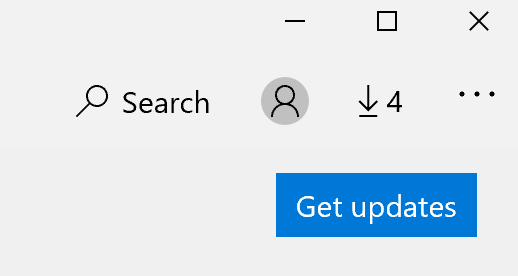

# Corriger la langue d’affichage des applications

Après avoir changé la langue d’affichage dans Windows 10, certaines applications peuvent toujours utiliser la langue précédente lorsque vous les ouvrez. Cela se produit car les nouvelles versions des applications pour cette langue doivent être téléchargées à partir du Windows Store. Pour résoudre ce problème, vous pouvez soit attendre la mise à jour automatique, soit installer manuellement la version mise à jour des applications.

Pour installer manuellement la mise à jour, **ouvrez Microsoft Store** puis cliquez sur **Téléchargements** et mises à jour dans le coin supérieur droit. Cliquez ensuite **sur Obtenir les mises à jour.** Si la langue n’est pas modifiée une fois la mise à jour terminée, essayez de redémarrer votre PC.

Pour en savoir plus sur les paramètres de langue d’entrée et [d’affichage,](https://support.microsoft.com/help/4027670/windows-10-add-and-switch-input-and-display-language-preferences)voir Gérer vos paramètres de langue d’entrée et d’affichage dans Windows 10 .
