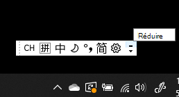
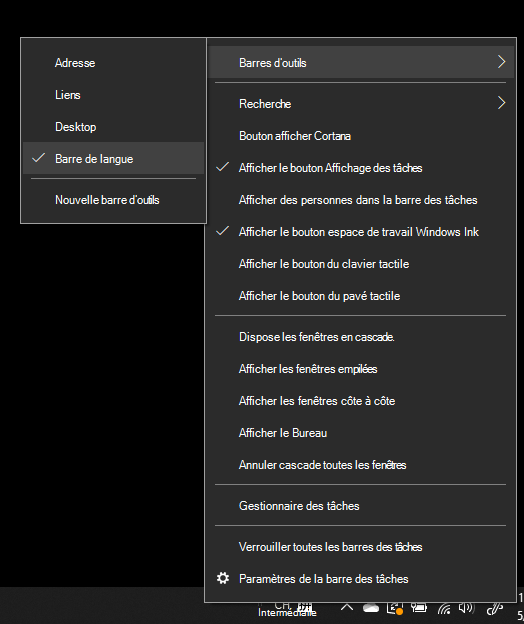
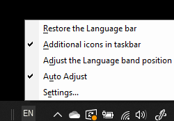

# Masquer, afficher ou réinitialiser la barre de langueHide, display, or reset the language bar

**Pour réduire la barre de langue :****To minimize the language bar:**

Dans le coin supérieur droit de la barre de langue, cliquez sur le bouton Réduire.You can click the minimize button on the top right corner of the language bar. Vous pouvez aussi réduire automatiquement la barre de langue en la faisant glisser vers la barre des tâches.Or, you can just drag the language bar to the task bar, which will automatically minimize it.

**Pour ouvrir la barre de langue dans une nouvelle fenêtre :****To pop out the language bar:**

Si vous ne voulez pas ancrer la barre de langue dans la barre des tâches, cliquez avec le bouton droit sur un espace vide de la barre des tâches, accédez au menu Barres d’outils, puis désactivez l’option **Barre de langue**.If you don't want to dock the language bar in the taskbar, right-click any empty space in the taskbar, and uncheck the **Language bar** option in the Toolbars menu. La barre de langue s’affiche alors en dehors de la barre des tâches, comme l’illustre la capture d’écran précédente.This will make the language bar appear outside the taskbar, just like the previous screenshot.

**Pour restaurer la barre de langue par défaut :****To restore the language bar to default:**

Cliquez avec le bouton droit sur le bouton de langue dans la barre d’outils, puis cliquez sur l’option **Restaurer la barre de langue** dans le menu.Right-click the language button in the toolbar, and click **Restore the language bar** option in the menu. Celle-ci est restaurée par défaut.This will restore it to default.

