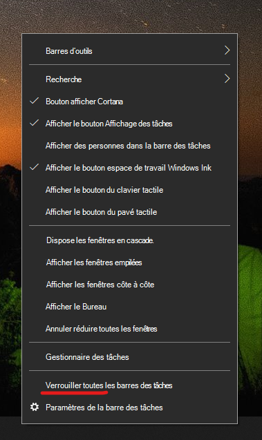

# Déplacer la barre des tâches sur l’un des côtés ou en haut de votre bureauMove the taskbar to either side or the top of your desktop

Tout d’abord, veuillez confirmer que la barre des tâches est déverrouillée.First, please confirm that the taskbar is unlocked. Pour savoir si votre barre est déverrouillée, cliquez avec le bouton droit sur un espace vide de la barre des tâches et vérifiez si **Verrouiller la barre des tâches** possède une coche située en regard.To find out whether yours is unlocked, right-click any empty space on the taskbar and see whether **Lock the taskbar** has a checkmark next to it. S’il existe une coche, la barre des tâches est verrouillée et ne peut pas être déplacée.If there is a checkmark, the taskbar is locked and cannot be moved. Un clic sur **Verrouiller la barre des tâches** la déverrouillera et supprimera la coche.Clicking **Lock the taskbar** once will unlock it and remove the checkmark.

Si vous disposez de plusieurs écrans qui affichent la barre des tâches, vous pouvez voir **Verrouiller toutes les barres des tâches**.If you have multiple monitors that display the taskbar, you will see **Lock all taskbars**.

Une fois la barre des tâches déverrouillée, vous pouvez appuyer de façon prolongée sur un espace vide de la barre des tâches et le faire glisser vers l’emplacement de votre choix sur l’écran.Once the taskbar is unlocked, you can press and hold any empty space on the taskbar and drag it to the location you want on the screen. Vous pouvez également cliquer avec le bouton droit sur un espace vide de la barre des tâches et accéder à **[Paramètres de la barre des tâches](ms-settings:taskbar?activationSource=GetHelp) > Emplacement de la barre des tâches à l’écran**.You can also do so by right-clicking on any empty space on the taskbar and go to **[Taskbar settings](ms-settings:taskbar?activationSource=GetHelp) > Taskbar location on screen**.
