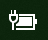

# Icône d’alimentation ou de batterie manquante dans Windows 10

Si votre appareil Windows 10 possède une batterie (par exemple, un ordinateur portable ou une tablette, ou un PC connecté via USB à un onduleur), une icône d’alimentation/de batterie apparaît habituellement dans la barre des tâches près de l’horloge, par exemple :

Si vous ne voyez pas cette icône, il est possible qu’elle soit masquée :

1. Accédez à **Paramètres [> Personnalisation > Barre des tâches](ms-settings:taskbar?activationSource=GetHelp)**.

2. Dans le volet de Notifications, cliquez sur **Sélectionner les icônes à afficher dans la barre des tâches**.

3. Recherchez ensuite l’élément d’**alimentation** dans la liste et définissez-le sur **Activé**.

    

**Résolution des problèmes**

Si vous avez suivi les instructions ci-dessus et que le bouton bascule d’**Alimentation** est grisé ou n’apparaît pas, dans la zone de recherche de la barre des tâches, tapez **gestionnaire d’appareils**, puis sélectionnez **Gestionnaire d’appareils** dans la liste des résultats. Sous **Batteries**, cliquez avec le bouton droit sur la batterie sur votre appareil, puis sur **Désactiver**, et enfin sur **Oui**. Patientez quelques secondes, puis cliquez avec le bouton droit sur la batterie, enfin cliquez sur **Activer**. Redémarrez ensuite votre appareil.

Si vous avez suivi les instructions ci-dessus, mais que l’icône de la batterie ne s’affiche pas dans la barre des tâches, dans la zone de recherche de la barre des tâches, tapez **gestionnaire des tâches**, puis cliquez sur **Gestionnaire des tâches** dans la liste des résultats. Sous l’onglet **Processus**, sous **Nom**, cliquez avec le bouton droit sur **Explorateur**, puis cliquez sur **Redémarrer**.
