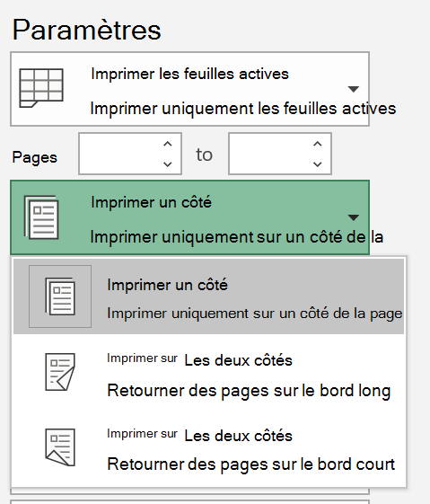
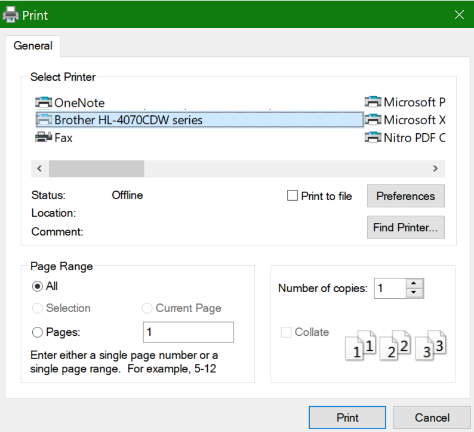

# Impression sur deux côtés (impression recto verso)

**Mon imprimante peut-elle effectuer une impression recto verso ?**

La synthèse des fonctionnalités ou le manuel de votre imprimante doivent vous indiquer s’il est possible d’imprimer sur les deux côtés du papier (également appelé « impression recto verso »). Si vous disposez de Microsoft Office, une autre méthode consiste à ouvrir une application Office telle que Word ou Excel, en accédant à **Fichier > Imprimer**, en vous assurant que l’imprimante appropriée est sélectionnée et en recherchant la possibilité dans la section Paramètres. Par exemple : 

**Impression recto verso dans Microsoft Office**

Si votre imprimante prend en charge l’impression recto-verso, lorsque vous accédez à **Fichier > Imprimer** dans l’application Office, l’option « imprimer en recto verso » s’affiche, comme illustré dans l’exemple ci-dessus.  Sélectionnez le type d’impression recto verso souhaité (retourner sur l’arête longue ou retourner sur le petit côté), puis cliquez sur **Imprimer** pour démarrer l’impression.

**Impression recto verso à partir d’une application**

Dans de nombreuses applications, une boîte de dialogue d’impression générale semblable à celle-ci s’affiche : 

Assurez-vous que l’imprimante appropriée est activée, puis cliquez sur **Préférences** pour ouvrir la fenêtre préférences de l’imprimante. Si l’imprimante prend en charge l’impression recto verso, la possibilité d’activer celle-ci pour le travail d’impression actuel s’affiche dans cette fenêtre.
