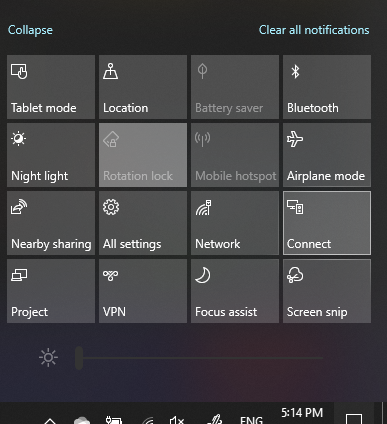

# Projeter sur un PC

Sur votre appareil de destination (vers lequel vous projetez), recherchez « Paramètres de projection » pour ouvrir la page Paramètres de **Projection sur ce PC**. Vérifiez ensuite les points suivants :
- Le menu déroulant « Certains appareils Windows et Android peuvent projeter sur cet ordinateur lorsque vous donnez votre accord » est défini sur **Toujours désactivé**.
- Le menu déroulant « Demander à projeter sur ce PC » est défini sur **Chaque fois qu’une connexion est requise**.
- Le menu déroulant « Demander le code PIN pour le couplage » est défini sur **Jamais**.

Sur votre appareil de destination, lancez l’application **Connect** en accédant à **Démarrer** et en recherchant « Connect ».

Ensuite, sur votre appareil source à partir duquel vous essayez de projeter :

1. Appuyez sur **touche Windows + A** pour ouvrir le centre de notifications.
2. Cliquez sur **Connecter**.
3. Cliquez sur l’appareil sur lequel vous voulez projeter l’écran.

Après les étapes ci-dessus, votre appareil de destination doit afficher l’écran de l’appareil source comme s’il s’agissait d’un moniteur secondaire.
