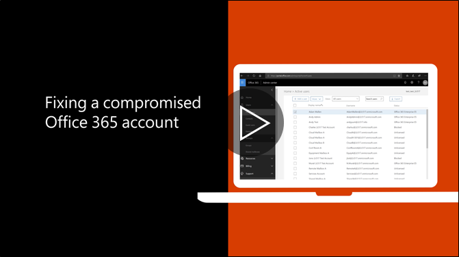

# Étapes recommandées à effectuer si un compte est compromis

  
1. [Réinitialiser le mot de passe](https://support.office.com/article/7a5d073b-7fae-4aa5-8f96-9ecd041aba9c) immédiatement. Ne pas communiquer le nouveau mot de passe par courrier électronique à l’utilisateur final. 
    
2. Supprimer n’importe quel suspects de [transfert d’adresses](https://support.office.com/article/ab5eb117-0f22-4fa7-a662-3a6bdb0add74) définie au niveau de la boîte aux lettres. 
    
3. Supprime les [règles de boîte de réception](https://support.office.com/article/1433E3A0-7FB0-4999-B536-50E05CB67FED) d' suspectes définies dans la boîte aux lettres. 
    
4. Si l’utilisateur est bloqué à partir de l’envoi de courrier électronique, [accédez à des utilisateurs restreints pour débloquer le compte](https://protection.office.com/?hash=/restrictedusers). Une fois que vous avez terminé, l’utilisateur doit être en mesure de reprendre l’envoi de messages dans l’heure.
    
5. Supprimer le compte d’utilisateur de tous les [groupes de rôles d’administration](https://support.office.com/article/eac4d046-1afd-4f1a-85fc-8219c79e1504) jusqu'à ce que vous êtes convaincu que le compte est compromis n’est plus. 
    
Pour réduire le risque d’une violation de données ou d’un compte compromis à l’avenir, nous vous recommandons de lire notre [article pratiques meilleures de sécurité pour Microsoft Office 365](https://support.office.com/article/9295e396-e53d-49b9-ae9b-0b5828cdedc3).
  

