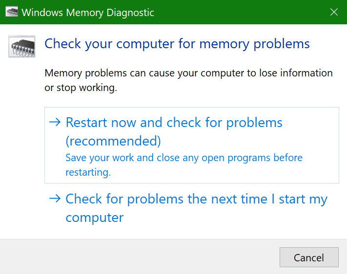
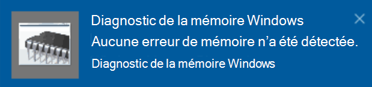

# Exécuter les Diagnostics de mémoire Windows dans Windows 10

Si Windows et les applications de votre PC se bloquent, se figent ou agissent de manière instable, il se peut qu’il y ait un problème avec la mémoire vive (RAM) du PC. Vous pouvez exécuter l’outil Diagnostic de mémoire Windows pour rechercher les problèmes liés à la mémoire vive du PC.

Dans la zone de recherche de la barre des tâches, tapez **Diagnostic de mémoire**, puis sélectionnez **Diagnostic de mémoire Windows**. 

Pour exécuter le diagnostic, le PC doit redémarrer. Vous avez la possibilité de redémarrer immédiatement (veuillez tout d’abord enregistrer votre travail, fermer les documents et les messages électroniques ouverts), ou de planifier l’exécution automatique du diagnostic lors du prochain démarrage de l’ordinateur :

Lorsque le PC redémarre, l’**Outil Diagnostics de mémoire Windows** s’exécute automatiquement. L’État et la progression s’affichent pendant l’exécution des diagnostics, et vous pouvez annuler les diagnostics en appuyant sur la touche **Échap** de votre clavier.

Une fois les diagnostics terminés, Windows démarre normalement.
Immédiatement après le redémarrage, lorsque le Bureau s’affiche, une notification apparaît (à côté de l’icône du **Centre de notifications** dans la barre des tâches) pour indiquer si des erreurs de mémoire ont été détectées. Par exemple :

Voici l’icône du Centre de notifications :  

Et un exemple de notification : 

Si vous n’avez pas vu la notification, vous pouvez sélectionner l’icône du **Centre de notifications** dans la barre des tâches pour afficher le **Centre de notifications** et une liste déroulante des notifications.

Pour consulter des informations détaillées, tapez **Évènements** dans la zone de recherche de la barre des tâches, puis sélectionnez **Observateur d’évènements**. Dans le volet gauche de l’**Observateur d’évènements**, accédez à **Journaux Windows > Système**. Dans le volet droit, parcourez la liste en examinant la colonne **Source**, jusqu’à ce que vous voyez les événements ayant pour valeur Source **MemoryDiagnostics-Results**. Sélectionnez chacun de ces événements et consultez les informations du résultat dans la zone située sous l’onglet **Général** en dessous de la liste.
