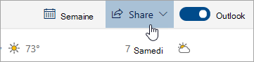

# Partage avec Outlook sur le webSharing with Outlook on the web

Dans votre calendrier, dans la barre d’outils située en haut de la page, sélectionnez **Partager**, puis sélectionnez le calendrier que vous voulez partager.From your Calendar, on the toolbar at the top of the page, select **Share**, and choose the calendar you want to share.

    

**Remarque** : vous ne pouvez pas partager des calendriers appartenant à d’autres personnes.**Note**: You can't share calendars owned by other people.

- Entrer le nom ou l’adresse de courrier électronique de la personne avec laquelle vous voulez partager votre calendrier.Enter the name or email address of the person you want to share your calendar with.
- Sélectionnez la manière dont vous voulez que la personne utilise votre calendrier :Choose how you want the person to use your calendar:
    - L’option **Peut afficher lorsque vous êtes occupé** leur permet de voir lorsque vous êtes occupé, mais n’inclut pas de détails tels que l’emplacement de l’événement.**Can view when I'm busy** lets them see when you're busy but doesn't include details like the event location.
    - L’option **Peut afficher les titres et les emplacements**  leur permet de voir lorsque vous êtes occupé(e), ainsi que le titre et l’emplacement des événements.**Can view titles and locations** lets them see when you're busy, as well as the title and location of events.
    - L’option **Peut afficher tous les détails**  leur permet d’afficher tous les détails de vos événements.**Can view all details** lets them see all the details of your events.
    - L’option **Peut modifier** leur permet de modifier votre calendrier.**Can edit** lets them edit your calendar.
    - L’option **Déléguer**  leur permet de modifier votre calendrier et de le partager avec d’autres personnes.**Delegate** lets them edit your calendar and share it with others.
- Sélectionnez **partager**.Select **Share**.
