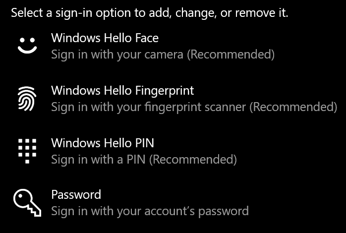

# Connexion à Windows 10 sans utiliser de mot de passe

Pour éviter d’avoir à taper un mot de passe au démarrage de Windows, nous vous recommandons d’utiliser l’une des options de connexion sécurisée Windows Hello, comme un code confidentiel, une reconnaissance de visage ou une empreinte digitale, si disponible. Si vous voulez vraiment désactiver la connexion sécurisée, consultez les instructions « connexion automatique à Windows 10 » ci-dessous.

**Solutions Windows Hello alternatives sécurisées au mot de passe du compte**

Accédez à **paramètres > comptes > options de connexion** (ou cliquez sur [ici](ms-settings:signinoptions?activationSource=GetHelp)). Les options de connexion disponibles seront affichées. Par exemple :

Cliquez ou appuyez sur l’une des options pour la configurer. La prochaine fois que vous démarrerez ou déverrouillerez Windows, vous serez en mesure d’utiliser la nouvelle option au lieu d’un mot de passe. 

**Connexion automatique à Windows 10**

**Remarque**: la connexion automatique est pratique, mais introduit un risque de sécurité, en particulier si votre PC est accessible par plusieurs personnes. 

1. Cliquez ou appuyez sur le bouton **Démarrer** dans la barre des tâches.

2. Tapez **netplwiz** et appuyez sur la touche entrée pour ouvrir la fenêtre comptes d’utilisateur.

3. Dans **comptes d’utilisateur**, cliquez sur le compte auquel vous souhaitez vous connecter automatiquement au démarrage de Windows.

4. Désactivez la case à cocher « les utilisateurs doivent entrer un nom d’utilisateur et un mot de passe pour utiliser cet ordinateur ».

    

5. Cliquez sur **OK**. Vous serez invité à entrer et à confirmer le mot de passe du compte que vous avez sélectionné. Cliquez sur **OK** pour terminer. La prochaine fois que Windows 10 démarre, il se connecte automatiquement au compte que vous avez sélectionné.
