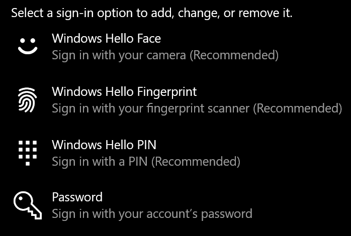
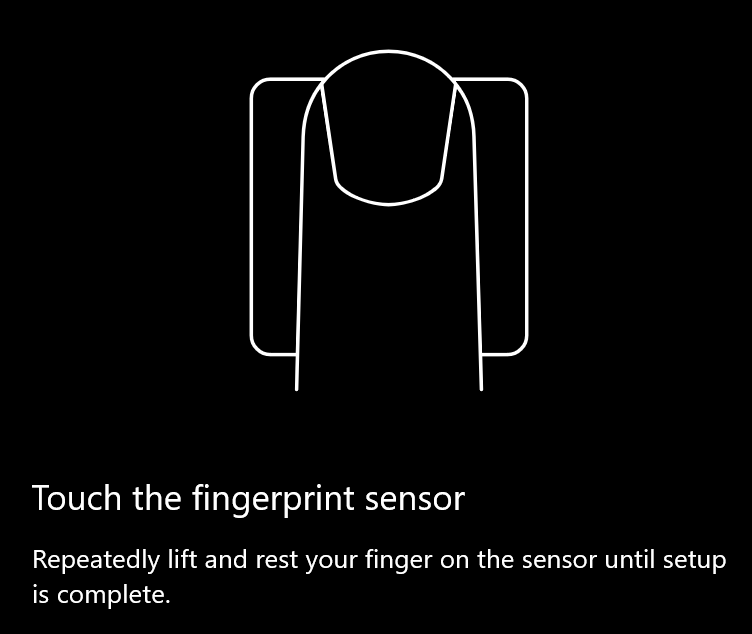
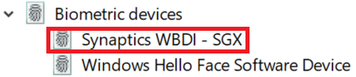

# Utiliser l’option de déverrouillage par empreinte digitale dans Windows 10

**Activer l’empreinte digitale Windows Hello**

Pour déverrouiller Windows 10 à l’aide de votre empreinte digitale, vous devez configurer une empreinte digitale Windows Hello en ajoutant (permettant à Windows d’apprendre à reconnaître) au moins un doigt. 

1. Accédez à **paramètres > comptes > options de connexion** (ou cliquez sur [ici](ms-settings:signinoptions?activationSource=GetHelp)). Les options de connexion disponibles seront affichées. Par exemple :

    

2. Cliquez ou appuyez sur **Windows Hello Fingerprint**, puis cliquez sur **configurer**. Dans la fenêtre installation de Windows Hello, cliquez sur **prise en main**. Le capteur d’empreintes digitales est activé et vous êtes invité à placer votre doigt sur le capteur :

   

3. Suivez les instructions, qui vous demanderont d’analyser votre doigt de manière répétée. Une fois cette opération terminée, vous aurez la possibilité d’ajouter d’autres doigts que vous souhaiterez peut-être utiliser pour vous connecter. La prochaine fois que vous vous connecterez à Windows 10, vous aurez la possibilité d’utiliser votre empreinte digitale pour le faire.

**Empreinte digitale Windows Hello non disponible en tant qu’option de connexion**

Si Windows Hello Fingerprint n’est pas affiché en tant qu’option dans les **options de connexion**, cela signifie que Windows n’est pas conscient d’un lecteur d’empreintes digitales ou d’un scanneur connecté à votre PC, ou qu’une stratégie système empêche son utilisation (si votre PC est géré par exemple). Pour résoudre les problèmes : 

1. Sélectionnez le bouton **Démarrer** dans la barre des tâches et recherchez **Gestionnaire de périphériques**.

2. Cliquez ou appuyez pour ouvrir le **Gestionnaire de périphériques**.

3. Dans le gestionnaire de périphériques, développez périphériques biométriques en cliquant sur le Chevron correspondant.

   

4. Votre scanneur d’empreintes digitales doit être mentionné comme un périphérique biométrique, tel que le scanneur Synaptics WBDI :

   

5. Si votre scanneur d’empreintes digitales n’est pas affiché et que le scanneur est intégré à votre PC, accédez au site Web du fabricant de PC. Dans la section Support technique de votre modèle PC, recherchez un pilote Windows 10 pour un scanneur que vous pouvez installer.

6. Si le scanneur est séparé du PC (attaché via USB), accédez au site Web du fabricant du scanneur pour trouver et installer le logiciel de pilote de périphérique Windows 10 pour le modèle de scanneur que vous avez.
