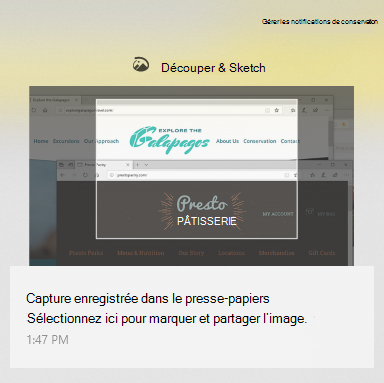

# Utiliser la capture & esquisse pour capturer, marquer et partager des images

L’esquisse est maintenant appelée **capture & esquisse**. **Pour effectuer une capture rapide**:

1. Appuyez sur la **touche du logo Windows + Maj + S**. Vous verrez votre écran obscurcir et le curseur affiché sous la forme d’une croix. 

2. Choisissez un point au niveau du bord de la zone à copier et cliquez sur le curseur. 

3. Déplacez votre curseur pour mettre en surbrillance la zone que vous souhaitez capturer. La zone que vous capturez apparaît à l’écran.

   

L’image que vous ciselés est enregistrée dans votre presse-papiers, prête à être collée dans un message électronique ou un document. 

**Si vous souhaitez modifier ou afficher l’image**: 

- Cliquez sur l’icône notifications située à l’extrême droite de la barre des tâches ; Ensuite, cliquez sur l’image que vous venez de capturer. Votre capture s’ouvre dans l’application de capture & esquisse.

   
