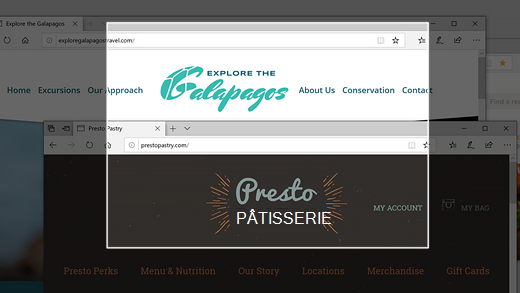

# Utiliser Snip & Sketch pour capturer, marquer et partager des images

L'croquis à l'écran s'appelle **désormais & Sketch**. **Pour prendre rapidement un snip**:

1. Appuyez **sur la touche de logo Windows + Shift + S**. Votre écran s'assombrit et votre curseur s'affiche sous la forme d'une croix. 

2. Choisissez un point au bord de la zone que vous souhaitez copier, puis cliquez avec le bouton gauche sur le curseur. 

3. Déplacez votre curseur pour mettre en surbrillez la zone que vous souhaitez capturer. La zone que vous capturez s'affiche sur votre écran.

   

L'image que vous avez extraite est enregistrée dans votre Presse-papiers, prête à être pastée dans un e-mail ou un document. 

**Si vous souhaitez modifier ou afficher l'image**: 

- Cliquez sur l'icône notifications à l'extrême droite de la barre des tâches ; cliquez ensuite sur l'image que vous avez capturée. Votre snip s'ouvre dans l'application & Sketch.

   
