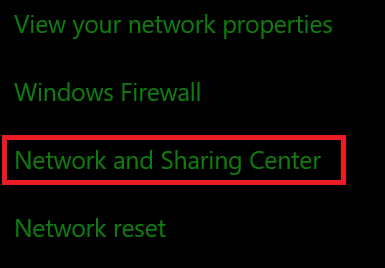
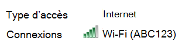
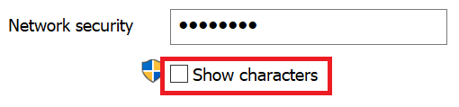

# Afficher Wi-Fi mot de passe réseau dans Windows 10

1. Assurez-vous que Windows 10 PC est connecté au Wi-Fi réseau.

2. Go to **Paramètres > Network & Internet > Status,** or click or tap [here](ms-settings:network?activationSource=GetHelp) to let us take you there now.)

3. Cliquez sur **Réseau et Centre de partage**.

    

4. Dans **le Centre de partage et réseau,** en regard de **Connexions,** vous verrez le nom de votre réseau sans fil. Par exemple, si votre réseau est nommé « ABC123 », vous pouvez voir :

    

    Cliquez sur le nom du réseau sans fil pour ouvrir la Wi-Fi Statut de l’utilisateur. 

5. Dans la fenêtre Wi-Fi statut, cliquez sur **Propriétés** sans fil, cliquez sur **l’onglet** Sécurité, puis cochez Afficher les **caractères.**

    

